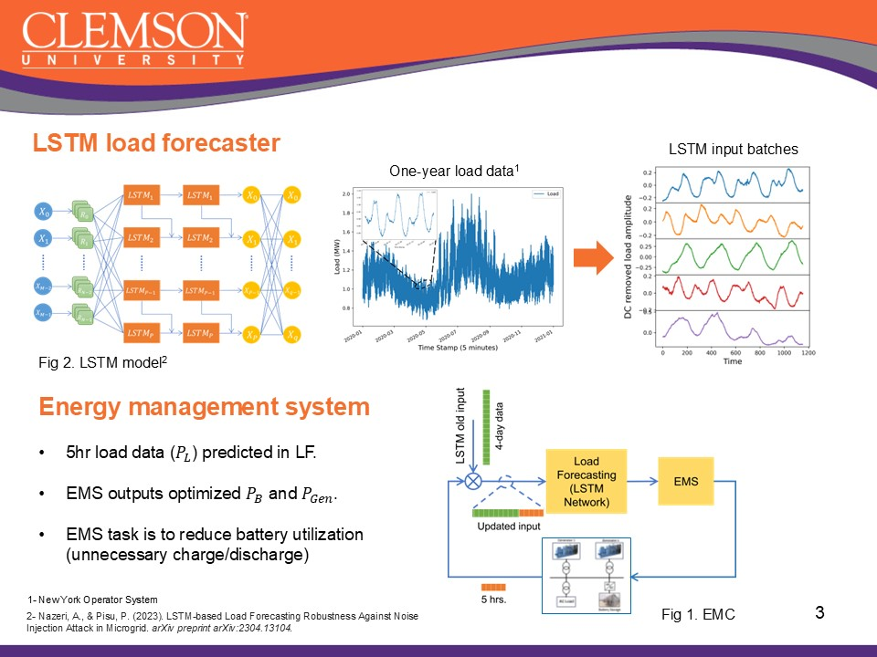
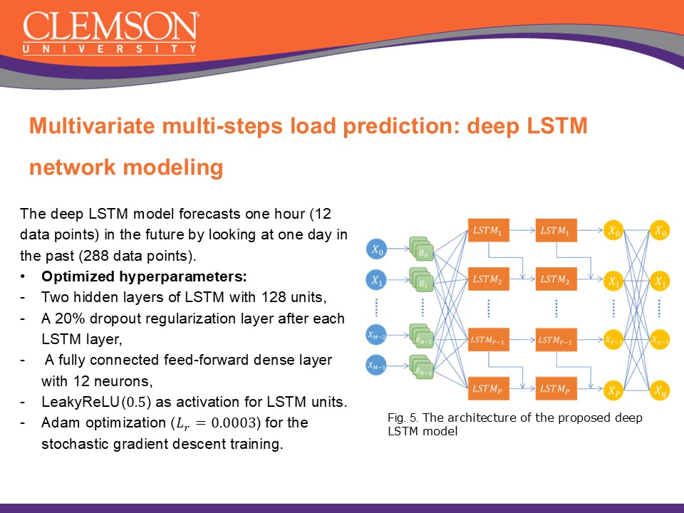

- Developed an **integrated Energy Management System (EMS)** for an islanded microgrid, combining forecasting and optimization for enhanced control.
- Utilized a **Multi-step Deep LSTM neural network** for accurate short- and long-term **load forecasting**, addressing temporal dependencies in power demand.
- Applied a **mixed-integer optimization algorithm** to determine optimal setpoints for decentralized microgrid controllers.
- Highlighted the **importance of accurate load forecasting** for efficient energy management, power distribution, and grid stability.
- Demonstrated the **vulnerability of deep learning models** like LSTM to cyberattacks, underlining the need for secure EMS designs.
- Showcased the superiority of **LSTM networks** over traditional RNNs in handling long-term dependencies without vanishing gradients.
- Supported EMS roles in **generation scheduling, economic dispatch, and demand-side management**, ensuring reliable and cost-effective microgrid operation.

[More information here](https://ieeexplore.ieee.org/abstract/document/10012180)