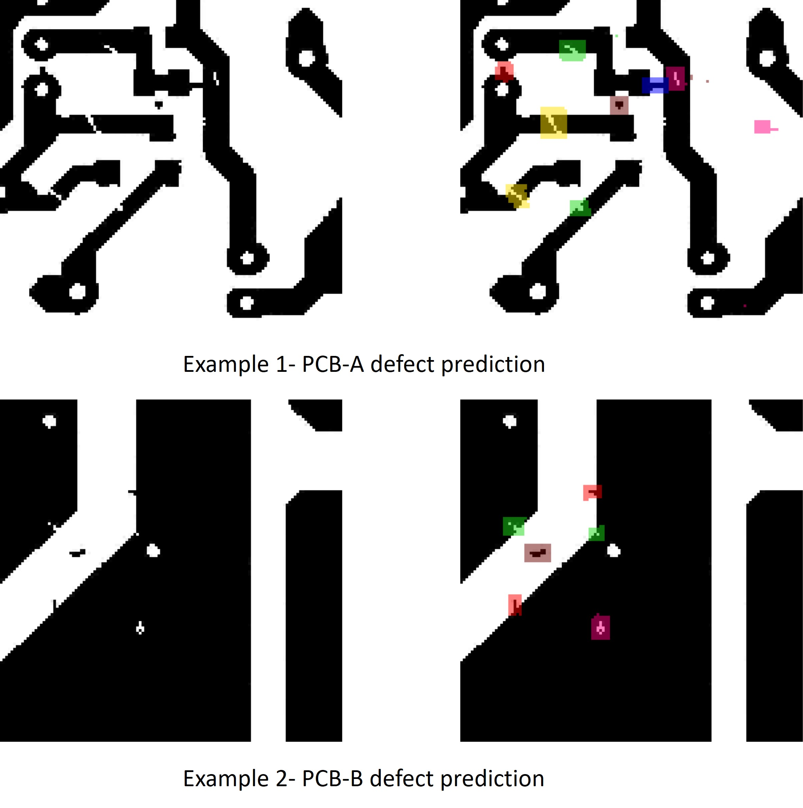
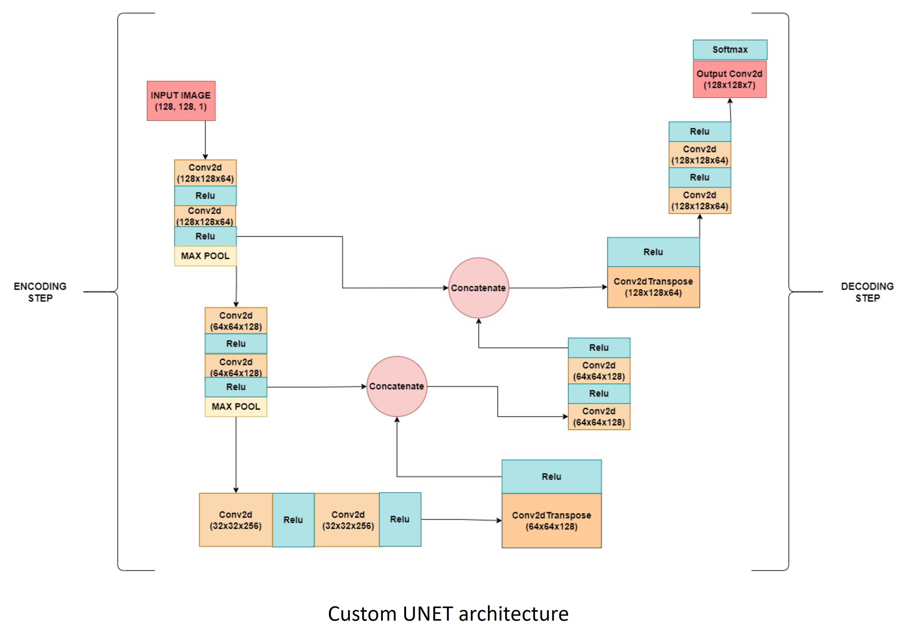

- **Printed Circuit Board (PCB) manufacturing and testing** are critical processes that are under increasing pressure due to the high global demand for consumer electronics.
- This rapid production pace has led to a rise in manufacturing **defects**, including **excess copper**, **open circuits**, and **short circuits**, which can waste material or render boards non-functional.
- Traditional **manual inspections**, often conducted at fixed intervals, are becoming impractical as production volumes rise.
- **Automated Visual Inspection (AVI)** systems offer a non-intrusive and scalable alternative for identifying defects during the manufacturing process.
- This project presents an **optimal method for automatic anomaly detection** in PCBs using a **U-Net architecture** for **semantic segmentation**, capable of:
  - **Detecting** and **localizing individual defects** at the pixel level.
  - **Classifying defect types** by labeling segmented areas.
- The proposed system is **validated through comparisons** between predicted segmentation results and ground truth images, ensuring detection accuracy.
- To address the issues of **model complexity, speed, and size**, we introduce a **low-weight pruning technique**, optimizing the deep neural network for real-time deployment without sacrificing performance.

[More information here](https://github.com/amirhnazerii/PCB_mulitclass_defect_detection_UNET/blob/main/AUE_UNET_final_paper.pdf)